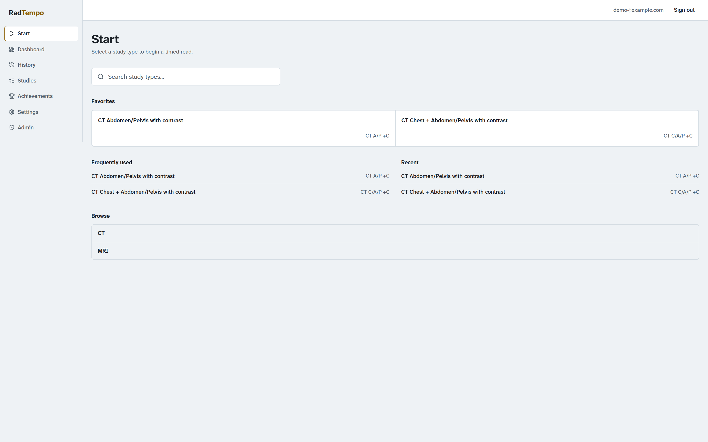
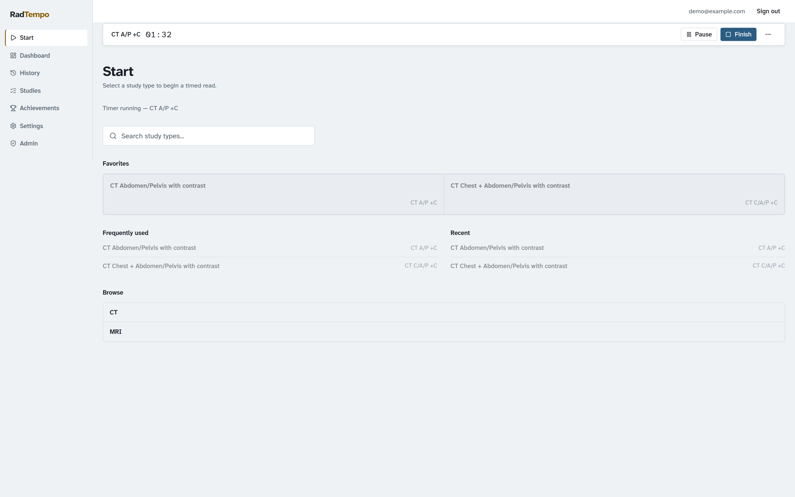
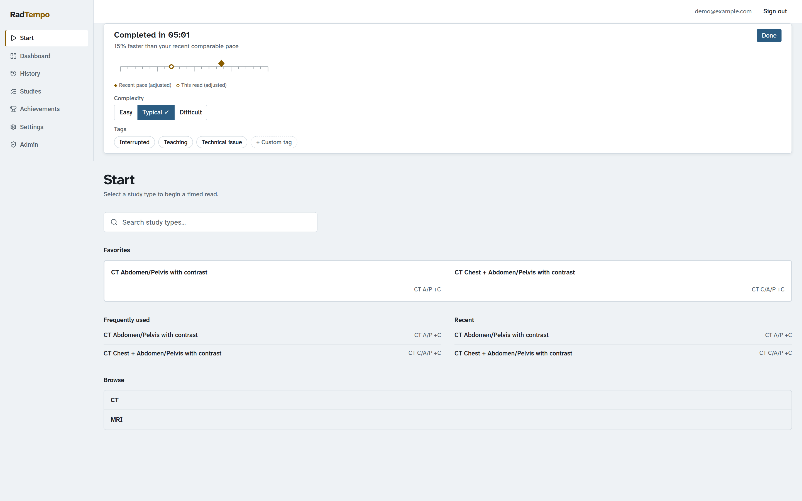
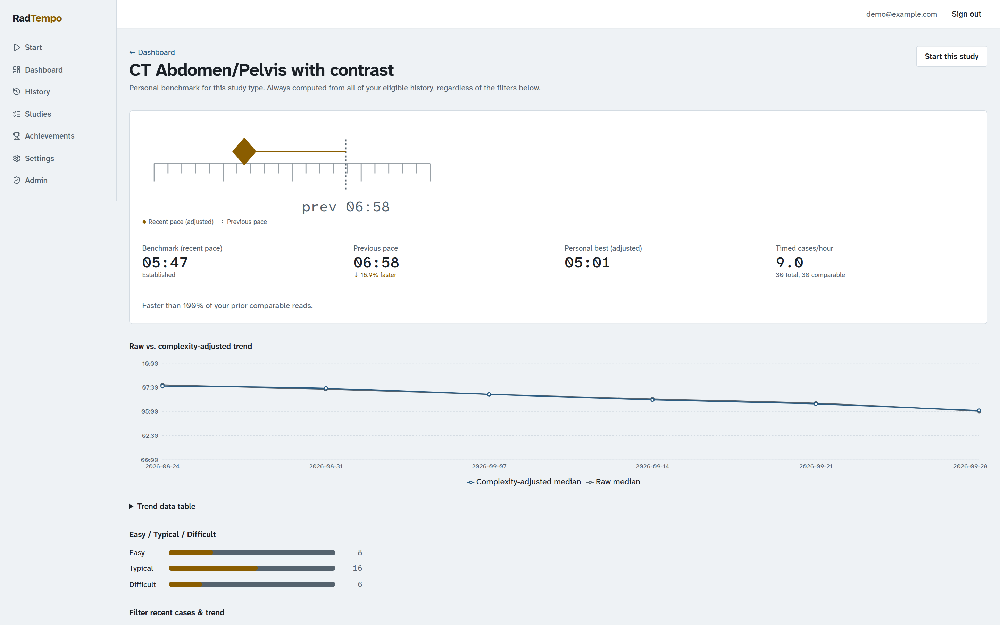
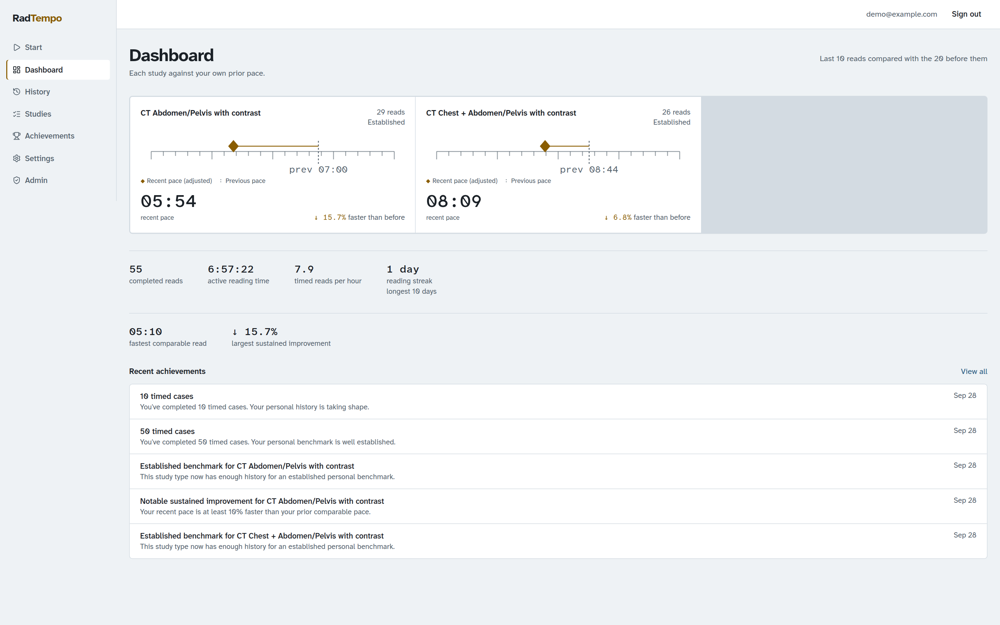
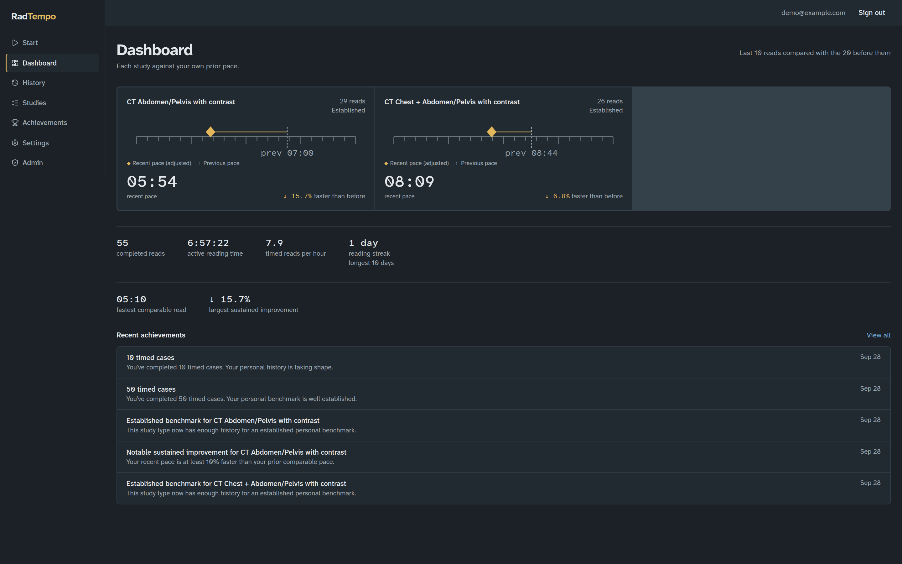

<div align="center">

# RadTempo

**Personal reading-pace tracking for radiologists**

Time your reads, tag their complexity, and watch your own pace trend over time — self-hosted, with no patient data and no leaderboard.

[](https://github.com/akeldgord/RadTempo/actions/workflows/ci.yml)
[](https://github.com/akeldgord/RadTempo/releases)
[](LICENSE)
[](#quick-start)

</div>

<br>

<p align="center">
  <a href="docs/media/radtempo-launch.mp4">
    
  </a>
  <br>
  <sub><a href="docs/media/radtempo-launch.mp4">Watch the full launch video with sound (21s)</a> · demo data is fictional</sub>
</p>

RadTempo helps radiologists measure and improve their interpretation pace. Choose the type of examination you're about to read, start the timer, finish the case, and RadTempo builds a personal picture of how your reading pace changes over time. No patient information is needed or intended to be stored. Your benchmark is your own prior performance.

- ✓ Self-hostable
- ✓ Personal analytics
- ✓ No PACS integration required
- ✓ No patient data required
- ✓ CT/MRI body-imaging presets
- ✓ Adaptive personal benchmarks

## How it works

1. **Choose** the study type you're about to read from your favorites, recents, or the full CT/MRI list.
2. **Start** the timer with one click. It survives refreshes and can be paused, resumed, or recovered.
3. **Finish** the case, mark it Easy, Typical, or Difficult, and optionally tag it (e.g. Interrupted, Teaching).
4. **Review** your personal benchmark for that study type — a rolling, complexity-adjusted median built entirely from your own history.

Nothing here is compared between radiologists. There is no leaderboard, department average, or admin view into any one user's numbers.

## Screenshots

<table>
  <tr>
    <td width="50%">
      
      <p align="center"><em>Start — favorites and recents for one-click timing</em></p>
    </td>
    <td width="50%">
      
      <p align="center"><em>A running timer, with pause, finish, and recovery</em></p>
    </td>
  </tr>
  <tr>
    <td width="50%">
      
      <p align="center"><em>Post-case panel — calm feedback, complexity, and tags</em></p>
    </td>
    <td width="50%">
      
      <p align="center"><em>Per-study detail — raw vs. complexity-adjusted trend</em></p>
    </td>
  </tr>
  <tr>
    <td width="50%">
      
      <p align="center"><em>Dashboard — each study against your own prior pace</em></p>
    </td>
    <td width="50%">
      
      <p align="center"><em>Dashboard in dark theme</em></p>
    </td>
  </tr>
</table>

## Features

**Timing**

- One-click start from favorites, recents, or the full study-type browser
- Pause/resume, duplicate-start protection, and recovery of an in-progress timer after a refresh or lost connection
- Post-case complexity rating (Easy/Typical/Difficult) and free-form tags (e.g. Interrupted, Teaching)

**Analytics**

- Personal, per-study benchmarks computed only from your own history — rolling windows, complexity adjustment, and excluded tags all documented in [`docs/analytics.md`](docs/analytics.md)
- Raw vs. complexity-adjusted trend charts, personal-best tracking, and dashboard-wide overview stats (completed cases, active reading time, cases/hour, reading-day streak)
- Achievements for milestones in your own history — never a comparison to anyone else

**Privacy**

- No PACS/RIS integration and no patient data fields anywhere in the app
- Only study type names and tag names accept free text, each with an explicit warning not to enter PHI
- The admin UI never shows any individual user's performance data

**Self-hosting**

- Single `docker compose up -d`, with an optional bundled Caddy reverse proxy for automatic TLS on a public domain
- Encrypted database backup and restore from the admin UI (`pg_dump`/`pg_restore` plus [`age`](https://github.com/FiloSottile/age)), documented in [`docs/backup-restore.md`](docs/backup-restore.md)
- Optional, off-by-default, anonymous instance-level telemetry — never user IDs, study data, or IPs

**Admin**

- Invite-only or open registration, SMTP-optional account flows, and admin-driven user creation/reset when SMTP isn't configured
- Instance settings, registration mode, and telemetry toggles from an admin UI that never surfaces user performance data

## What RadTempo is not

- Not a PACS, RIS, or reporting system.
- Not a productivity monitor, QA platform, or surveillance tool.
- Not a leaderboard or comparison tool between radiologists, departments, or institutions.
- Not a HIPAA compliance product or claim. RadTempo is designed to avoid handling PHI, but self-hosting operators remain responsible for their own compliance obligations.

## Quick start

```bash
git clone https://github.com/akeldgord/RadTempo.git
cd RadTempo
cp .env.example .env
```

Generate a secret for `AUTH_SECRET` and set it in `.env`:

```bash
openssl rand -base64 32
```

Set `POSTGRES_PASSWORD` in `.env` to a strong password.

Then start the app:

```bash
docker compose up -d
```

Before first start, either set `INITIAL_ADMIN_EMAIL`/`INITIAL_ADMIN_PASSWORD` in `.env` to have an admin account created automatically, or set `SETUP_TOKEN` (generate with `openssl rand -base64 32`) to use the `/setup` wizard instead. There are no default credentials, and being the first visitor never grants access on its own — one of these must be configured or `/setup` refuses to create anyone.

Open `http://localhost:3000`. On first run without `INITIAL_ADMIN_EMAIL`, you'll be sent to `/setup`, where you enter the setup token plus the initial admin's name, email, and password. See [`docs/configuration.md`](docs/configuration.md) for details.

### Exposing RadTempo on a public domain

RadTempo ships with an optional bundled [Caddy](https://caddyserver.com/) reverse proxy that handles TLS automatically. Set `DOMAIN` in `.env` to your public hostname, then run (requires Docker Compose >= 2.24, for the `!reset` merge directive on the app's port publication):

```bash
docker compose -f docker-compose.yml -f docker-compose.caddy.yml up -d
```

This also stops the `app` container from publishing its own host port directly — Caddy becomes the only thing exposed on ports 80/443. If you'd rather use an existing reverse proxy (Caddy, Nginx, Traefik, etc.), see [`docs/reverse-proxy.md`](docs/reverse-proxy.md).

## Documentation

| Doc                                              | Covers                                            |
| ------------------------------------------------ | ------------------------------------------------- |
| [Configuration reference](docs/configuration.md) | All environment variables                         |
| [Reverse proxy setup](docs/reverse-proxy.md)     | Caddy, Nginx, Traefik                             |
| [Privacy](docs/privacy.md)                       | What is and isn't stored, telemetry, admin access |
| [Backup & restore](docs/backup-restore.md)       | Encrypted backups, disaster recovery              |
| [Analytics methodology](docs/analytics.md)       | How personal benchmarks are computed              |
| [Licensing](docs/licensing.md)                   | What the license allows and doesn't allow         |
| [Security policy](SECURITY.md)                   | Reporting a vulnerability                         |
| [Contributing](CONTRIBUTING.md)                  | Code contributions                                |

## Privacy, in brief

RadTempo is built so that PHI never needs to enter the system: it stores study type names, timings, complexity ratings, and tags — not patient identifiers, accession numbers, report text, or images. Free-text fields (custom study type and tag names) carry an explicit warning not to enter patient information.

The admin UI never shows any individual user's performance data to an administrator. However, the people who administer the underlying infrastructure — the database, the server, and backups — can technically access stored data directly, outside the application. This is disclosed here deliberately: self-hosting means you (or whoever runs your instance) are that infrastructure administrator, and should treat the database and backups accordingly.

Anonymous instance-level telemetry is available but off by default; see [`docs/privacy.md`](docs/privacy.md) for exactly what it would send.

## License

RadTempo is **source available** under [PolyForm Shield 1.0.0](https://polyformproject.org/licenses/shield/1.0.0). It is not open source: you can run, self-host, and modify it, but the license carries a noncompete condition. Copyright (c) 2026 Torus LLC. See [`LICENSE`](LICENSE) for the full text and [`docs/licensing.md`](docs/licensing.md) for a plain-language summary of what's allowed.

## Contributing & security

Bug reports, feature ideas, and code contributions are welcome — see [`CONTRIBUTING.md`](CONTRIBUTING.md). Please report suspected security vulnerabilities privately per [`SECURITY.md`](SECURITY.md), not in a public issue.
